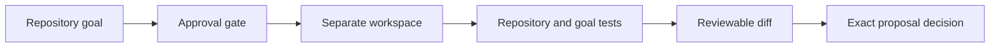

# Keep

Turn a repository goal into a tested, reviewable proposal, with an audit trail and explicit decisions.

Keep is a self-hosted agent platform for ongoing projects. Its repository workflow combines a separate working copy, test execution, review controls and recoverable project state. This Linux x64 research preview lets you try that workflow before configuring a model account.

## Try a change you can inspect

Follow the [checksum-first installation guide](docs/quickstart.md), then run:

```sh
keep demo project
```

You need Node.js 22.23.2, npm and Git. No API key, Rust or C compiler is needed for the installed walkthrough. It creates its own temporary repository and uses two scripted local responses; sample approval and veto actions are simulated.

```text
PASS  Approval gate held: 0 model calls before sample approval
PASS  Materialized change: retry limit 0 → 7
PASS  Tests: limit; goal: requested outcome
PASS  Restart retained the proposal without replay
PASS  Wrong token refused; exact proposal vetoed; original source unchanged
```

The command prints the real proposed diff and the directory containing the sample repository, edited workspace, test results and command records. You can inspect the result rather than taking a model's word for it. [What the walkthrough demonstrates](docs/portfolio-walkthrough.md) explains the scripted responses and evidence limits.



For the companion recovery experiment, run `keep demo recovery`: 24 synthetic checks, no model calls. For your own repository, [configure a provider and repository](docs/installed-solve.md), run `keep doctor`, then `keep solve "your goal"`.

## Current preview

**0.0.12-preview.1**, Linux x64. [Release and downloads](https://github.com/RedRookAI/keep-research-preview/releases/tag/keep-preview-2026-10-05.1) · [Installation](docs/quickstart.md) · [Exact release record](KEEP_RELEASE.md).

This preview includes the repository walkthrough, installed solve wiring, budget-bound FrontDoor/provider diagnostics and manual memory/query monetary admission from the recent source checkpoints. The package carries compiled JavaScript, its existing bundled TypeScript dependency and three genuine native executables. Ordinary installation needs no native toolchain.

The measured Bubblewrap 0.13.0 pin remains required for required-jail operations. Installing the package does not install a host launcher or change security policy. Optional native transport has separate [custody prerequisites](SECURITY.md#optional-native-refusal-transport-installation-prerequisites).

A successful scripted walkthrough demonstrates this workflow, not general model quality, live organization onboarding or production isolation. Keep remains a research preview, with [explicit open requirements](docs/completion-map.md) and [evidence boundaries](docs/evidence.md). The older releases retain their original artifacts and qualification identities.

## Explore the project

- [Repository walkthrough and retained artifacts](docs/portfolio-walkthrough.md)
- [Use a configured model on your repository](docs/installed-solve.md)
- [Memory](docs/semantic-memory.md), [skills](docs/skill-registry.md), [backups](docs/backup.md) and [monetary accounting](docs/monetary-accounting.md)
- [Qualification evidence](docs/evidence.md) and [remaining work](docs/completion-map.md)
- [Contributing and pinned source builds](WORKFLOW.md)
- [Security and private reporting](SECURITY.md)
- [Licensing and attribution](docs/licensing.md)

Source checkpoint0.0.13-preview.1 adds [owner-project Codex generation](docs/codex-project.md), using existing subscription access. New downloadable qualification and the real issue case study are pending; the release above remains the latest qualified download.

The Codex source checkpoint remains experimental: its first installed native attempt failed without usable output. The follow-up approval and diagnostic fixes are recorded in the [case status and tickets](docs/maintenance/codex-case-20261007/INDEX.md). No successful real-model case or new qualified download is claimed.
